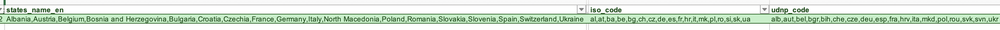
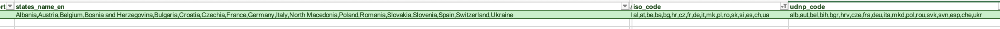

# POVOAMENTO DA BASE DE DADOS

Para poder povoar a base de dados dinamicamente a partir do ficheiro Excel fornecido pela UNESCO, foi necessario modificar algumas informações nas colunas  'iso_code' e 'udnp_code'.

Como criamos um programa que faz a extração da informação do ficheiro Excel para a base de dados, precisávamos que o formato das informações fosse idêntico em cada coluna. 

No entanto, havia casos em que a ordem dos 'iso_codes' e 'udnp_codes' não conincidiam com a ordem em que os países estavam guardados na coluna 'states_name_en'. 
Como eram poucos casos, alterámos manualmente a ordem dos códigos.

Exemplo de como a ordem estava antes: 

Exemplo de como a ordem foi corigida: 

